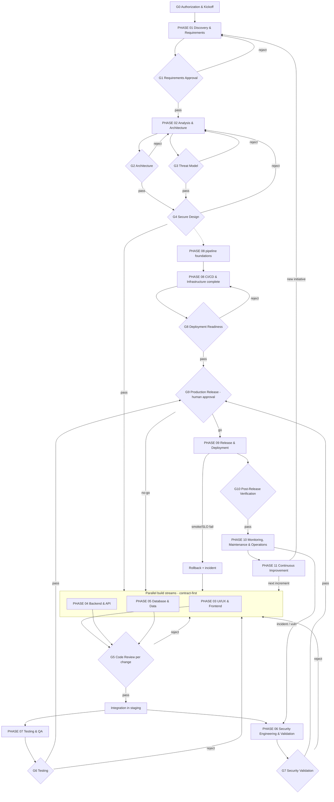

# PART 16 — MASTER WORKFLOW DIAGRAM

```mermaid
flowchart TD
    K[G0 Authorization & Kickoff] --> P1[PHASE 01 Discovery & Requirements]
    P1 --> G1{G1 Requirements Approval}
    G1 -- reject --> P1
    G1 -- pass --> P2[PHASE 02 Analysis & Architecture]
    P2 --> G2{G2 Architecture}
    P2 --> G3{G3 Threat Model}
    G2 -- reject --> P2
    G3 -- reject --> P2
    G2 -- pass --> G4{G4 Secure Design}
    G3 -- pass --> G4
    G4 -- reject --> P2
    G4 -- pass --> PAR

    subgraph PAR [Parallel build streams - contract-first]
        P3[PHASE 03 UI/UX & Frontend]
        P4[PHASE 04 Backend & API]
        P5[PHASE 05 Database & Data]
    end
    G4 -.-> P8a[PHASE 08 pipeline foundations]
    P3 --> G5{G5 Code Review per change}
    P4 --> G5
    P5 --> G5
    G5 -- reject --> PAR
    G5 -- pass --> INT[Integration in staging]

    INT --> P7[PHASE 07 Testing & QA]
    INT --> P6[PHASE 06 Security Engineering & Validation]
    P7 --> G6{G6 Testing}
    P6 --> G7{G7 Security Validation}
    G6 -- reject --> PAR
    G7 -- reject --> PAR
    P8a --> P8[PHASE 08 CI/CD & Infrastructure complete]
    P8 --> G8{G8 Deployment Readiness}
    G6 -- pass --> G9
    G7 -- pass --> G9
    G8 -- pass --> G9{G9 Production Release - human approval}
    G8 -- reject --> P8
    G9 -- no-go --> PAR
    G9 -- go --> P9[PHASE 09 Release & Deployment]
    P9 -- smoke/SLO fail --> RB[Rollback + incident] --> PAR
    P9 --> G10{G10 Post-Release Verification}
    G10 -- pass --> P10[PHASE 10 Monitoring, Maintenance & Operations]
    P10 --> P11[PHASE 11 Continuous Improvement]
    P11 -- next increment --> PAR
    P11 -- new initiative --> P1
    P10 -- incident / vuln --> P6
```

---
