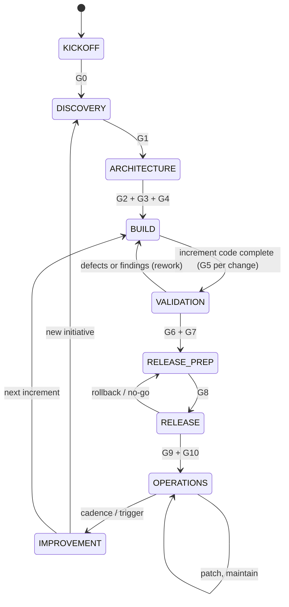

# PART 9 — WORKFLOW DEPENDENCIES AND STATE TRANSITIONS

## 9.1 Phase-level state machine

```mermaid
stateDiagram-v2
    [*] --> KICKOFF
    KICKOFF --> DISCOVERY: G0
    DISCOVERY --> ARCHITECTURE: G1
    ARCHITECTURE --> BUILD: G2 + G3 + G4
    BUILD --> VALIDATION: increment code complete (G5 per change)
    VALIDATION --> BUILD: defects or findings (rework)
    VALIDATION --> RELEASE_PREP: G6 + G7
    RELEASE_PREP --> RELEASE: G8
    RELEASE --> OPERATIONS: G9 + G10
    RELEASE --> RELEASE_PREP: rollback / no-go
    OPERATIONS --> IMPROVEMENT: cadence / trigger
    IMPROVEMENT --> DISCOVERY: new initiative
    IMPROVEMENT --> BUILD: next increment
    OPERATIONS --> OPERATIONS: patch, maintain
```
